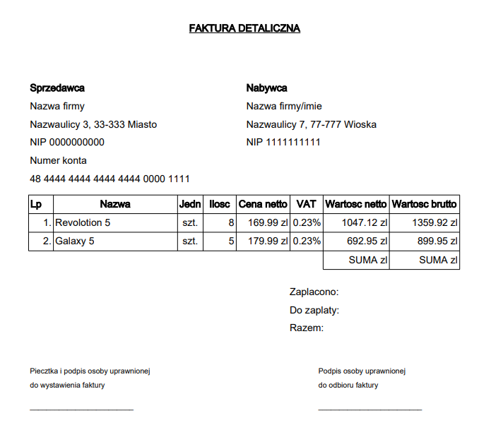

# RoyalWebStore

##### Design inspired by my actual work - full shop and warehouse system.

###### My bigest backend project. Prepare my own application for future Angular learning and reviev all information about java and spring. 

### Technology used:

+ Secured by Spring Security: 
  * OAuth2
  * BCryptPasswordEncoder
  * JDBCauthentication

+ Design in MVC model:
  * Seperate logic in service implementation
  * Seperate interfaces
  * Clear structures and packages
  * H2 database in develope mode
  * CRUD operations with JPA
  * ORM with Hibernate
  * Thoughtful ERD

+ Test by jUnit & Mockito:
  * Exceptions throwing tests 

+ Managed by Maven. 
+ Stored in Tomcat.
+ Documented in GitHub.

### About key functionalities:

#### Sales invoice generator based template (data binding in progress...). 
##### Ultimately, the user will be able to generate an invoice for a given order and open it in a web browser.

